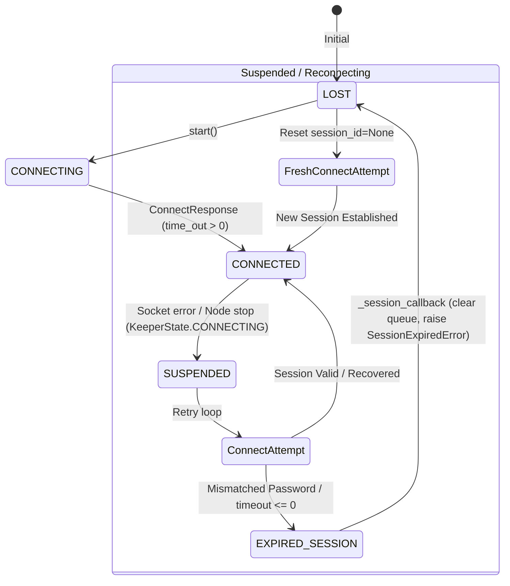

# Data Model: Client Request Queuing & Session Lifecycle

**Feature**: `004-fix-test-client-flakiness` | **Date**: 2026-08-29 | **Spec**: [spec.md](spec.md)

## Entities

### 1. Request Queue (`KazooClient._queue`)

The in-memory FIFO buffer that holds requests submitted while the client is disconnected or while socket writing is deferred.

| Field | Type | Description |
| :--- | :--- | :--- |
| `request` | `object` (`Create`, `GetData`, `SetData`, `Delete`, etc.) | Serialized ZooKeeper wire request packet. |
| `async_object` | `IAsyncResult` (e.g. `AsyncResult`) | Async handle returned to the caller that receives the result or exception. |

#### Queue Invariants & State Transitions
- **Enqueueing (`_call`)**: Allowed when client is `CONNECTED` or `SUSPENDED` (`KeeperState.CONNECTED`, `CONNECTED_RO`, `CONNECTING`). Rejected immediately with exception if in `CLOSED`, `AUTH_FAILED`, or `EXPIRED_SESSION`.
- **Drain upon Reconnection (Session Recovered)**: Connection loop processes `self._read_sock` wakeups, calls `_send_request()`, pops `(request, async_object)` from `_queue`, submits to socket, and appends `(request, async_object, xid)` to `_pending`.
- **Drain upon Session Expiration (Session Expired)**: `_session_callback(KeeperState.EXPIRED_SESSION)` calls `_notify_pending(KeeperState.EXPIRED_SESSION)`. All items in `_queue` (and `_pending`) are popped and their `async_object.set_exception(SessionExpiredError())` is invoked. `_reset()` reinstantiates `_queue = deque()`.

---

### 2. Session Credential State

The client's authentication and session identification attributes exchanged during the wire-level connection handshake.

| Attribute | Type | Initial Value | Recovered Session | Expired / Reset Session |
| :--- | :--- | :--- | :--- | :--- |
| `_session_id` | `int \| None` | `None` (sent as `0`) | Server-assigned 64-bit ID | `None` (reset via `_reset_session()`) |
| `_session_passwd` | `bytes` (16 bytes) | `b"\x00" * 16` | 16-byte server token | `b"\x00" * 16` |
| `last_zxid` | `int` | `0` | Monotonically increasing ZK transaction ID | `0` |

#### Wire Protocol Packet Definitions
- **`Connect` (Client -> Server)**:
  `protocol_version (int32)`, `last_zxid_seen (int64)`, `time_out (int32)`, `session_id (int64)`, `passwd (16 bytes)`, `read_only (bool)`
- **`ConnectResponse` (Server -> Client)**:
  `protocol_version (int32)`, `time_out (int32)`, `session_id (int64)`, `passwd (16 bytes)`, `read_only (bool)`
  - *Normal connect / recovery*: `time_out > 0`, `session_id > 0`, `passwd = [16 random bytes]`.
  - *Mangled / expired session*: `time_out <= 0` (0), `session_id = 0`, `passwd = [16 zero bytes]`.

---

### 3. Connection State Machine

